# RasspberryPi  [https://www.raspberrypi.com/documentation/]
 
  


# Agenda : 

 - Install Linux 
 - Navigate the system  
 - gpio Applications
 - smart home applications 
 - we server 

# Linux customization : 

<ol>
<li>BTL Customizatoin </li>
<li>Linux kernal </li>
<li>File System customization </li>
<li>Tool chain customizatoin 
</ol>


# Yocto 

- Mix between Application and customization to produce new kernal 


# Difference between image and Distribution 

- Destrobution has extra feature than the other 
- iMAGE DEPLOYED OVER THE MACHINE 

#### Through this course rasspberry pi kit will be the target and lab top will be the host machine.

-  host machine [LabTop] : to build and develop the software and generate the exe or binaries 

-  target [RPBI]  : To install the developed code over it.


## Embedded Linux programming approaches 

## 01 - Through Paremetal 

- No existance of thirdparty or OS The code interacted directlly with the baremetal without operating system 

## 02 - Through OS 

-  The OS placed in between the application and Paremetal 
-  Take time for basic driver development 
* Advantages 
<ol>
<li>EXistance of schedular to manage tasks, proceses, Handle different useres,HW Driver support[WIFI - Eathernet- supporive - despoachers - stacks ]</li>
<li>ease of building verry complex applications [plug and play concept ]</li>
<li>Usage of different programs like python over OS </li>
</ol>

[Note]
- domain controller concept: based on  dividing the car sw into domains runs over different controllers wit OS 

* DisAdvantages 

<ol>
<li>Consume resources [Processing , ROM , RAM] </li>
<li>OS is heavy in the Resources </li>
</ol>


## Types Of OS 

### Hard real time 

- Based on applicaion and it is related to the time margine +- 0.000?
    - Autosar based : osek operating system is hard real time <br >
    - Linux based :  depends which may be : 
        - MICR kernal : `hard real time kernal`, which based on modules isolation and interprocess communication such as [bike os by vector - Integrity - qnx]

### Soft real time 

       - Monolothic  : Very complex, interconnected and not hard real time time waster.


# History Of RPbi 

Raspberry Pi is a series of small single-board computers developed in
the United Kingdom by the `Raspberry Pi Foundation in association`
with Broadcom. Early on, the Raspberry Pi project leaned towards the
promotion of ` teaching basic computer science in schools and in developing
countries ` . Later, the original model became far more popular than
anticipated, selling outside its target market for uses such as robotics. It is now
widely used in many areas, such as for weather monitoring, because of its low
cost, modularity, and open design. <br >

  


The Raspberry Pi is a credit-card-sized fully functioning
computer (System on chip) created by the non-profit
Raspberry Pi Foundation in the UK. It’s considered as a SOC
(system on chip) device that runs on a Linux OS specially
designed for it, called Raspbian.

• Raspbian is the official OS for Raspberry Pi, where other
third party OSes like Firefox OS, Android, RISC OS, Ubuntu
Mate . can be installed on Pi, even Windows 10 version is
also available for Pi.
• Like a computer, It has memory, processor, USB ports, audio output, graphic
driver for HDMI output .


## Raspberry Pi Applications:

<ol>
<li>Smart home automation</li>
<li>ROV and Robots</li>
<li>Camera systems</li>
<li>Smart TV</li>
<li>super computers</li>
<li>open cv projects</li>
<li>machine learning projects</li>
<li>automotive applications</li>
<li>IOT projects</li>

</ol>

## Why Raspberry pi ?

<ol>
<li>Complete computing platform</li>
<li>Cheap</li>
<li>Raw</li>
<li>It doesn’t come hidden away in a box, you have access to the GPIO.</li>
<li>Runs Linux</li>
</ol>


## What can you do with it?

<ol>
<li>General purpose computing</li>
<li>Learning programming</li>
<li>It comes preloaded with compilers and interpreters for many languages.</li>
<li>Project platform because of its ability to integrate with electronics and</li>
<li>interacting with external devices</li>
<li>Product prototyping</li>
<li>Embedded linux products.</li>
<li>Embedded systems solutions.</li>
<li>IOT prototyping.</li>

# Comparassion 
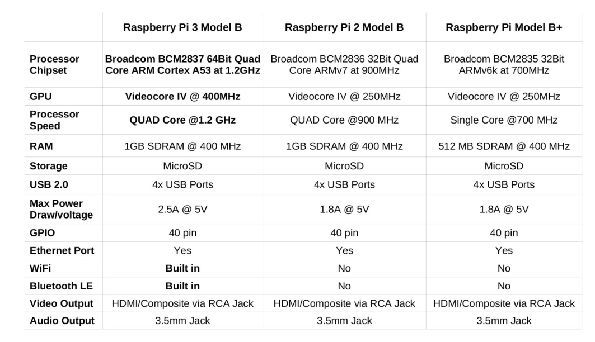  

  

# rpbi kit
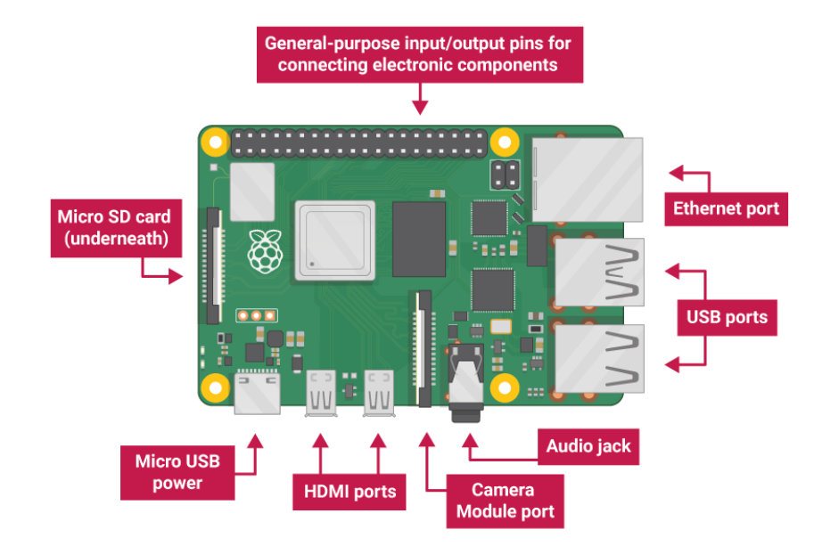  

# Raspberry pi 3 pinout 

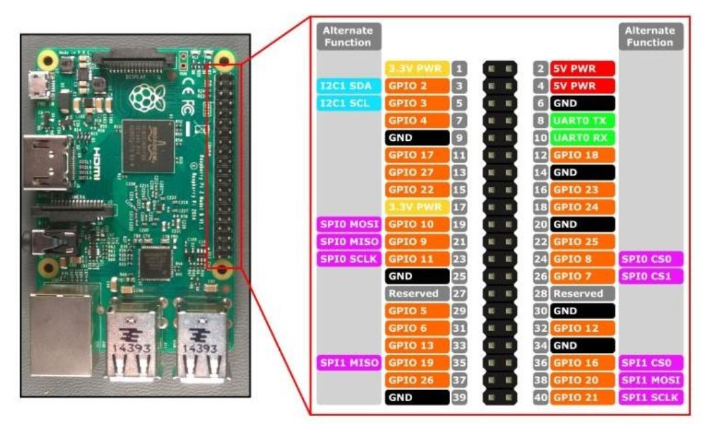  


#  OS Installation 

- Needed tools 
    - [win3DiskImager](https://sourceforge.net/projects/win32diskimager/) To let the image be downloadded in boatable manner   
    - [VNC](https://www.realvnc.com/en/connect/download/viewer/windows/)
    - [putty](https://www.putty.org/)
    - [scp window](https://sourceforge.net/projects/winscp/files/WinSCP/5.21.5/WinSCP-5.21.5-Setup.exe/download)
    - SD card reader 
    - [Angry ip scanner](https://angryip.org/) 

# steps 
 
  - Format the sd card as NTFS 
  - download and unzip https://www.raspberrypi.com/software/operating-systems/
  - Include the image to win32 Disk imager and `write ` [Install Linux on SD Card ]
    

  


## Rassperry operating modes: 

- Notmal mode : 

    - Through keyboard , mouse and screen 

- Headless mode : 
  
    - Provide  using personal laptop screen, mouse and keyboard bi
    - Connection done through same network using 
    - Connection based on sshconnection `Secure shell connection `
         - Adjust Rpb wifi Connection 
            

              - By openning the boot folder using reader of sd card
              - create new file called `ssh`  to enable ssh
              - create new file called `wpa_supplicant.conf`  for more [details https://linux.die.net/man/5/wpa_supplicant.conf]

              - Write the following inside the file to be able to connect to your wifi 
```

ctrl_interface=/var/run/wpa_supplicant
ctrl_interface_group=0
ap_scan=1
update_config=1
country=eg


network={
        mode=0
        priority=1
        scan_ssid=1
        proto=WPA2
        key_mgmt=WPA-PSK
        pairwise=TKIP
        group=TKIP
        ssid="SSID"
        psk="PSWD"
}

network={
        ssid="SecondNetworkSSID"
        psk="Second Network PSWD"
}


``` 
              - Set the sd card back to to the rasspberry pi 
              - To detect rasbperry ip use `Angry ip scanner`

             -  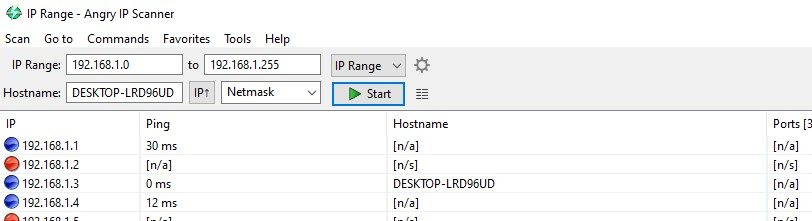  

             - To access through `ssh`Open putty in your windows machine and write`raspberrypi.local`, Then write user name `pi` and password `raspberry`

              - 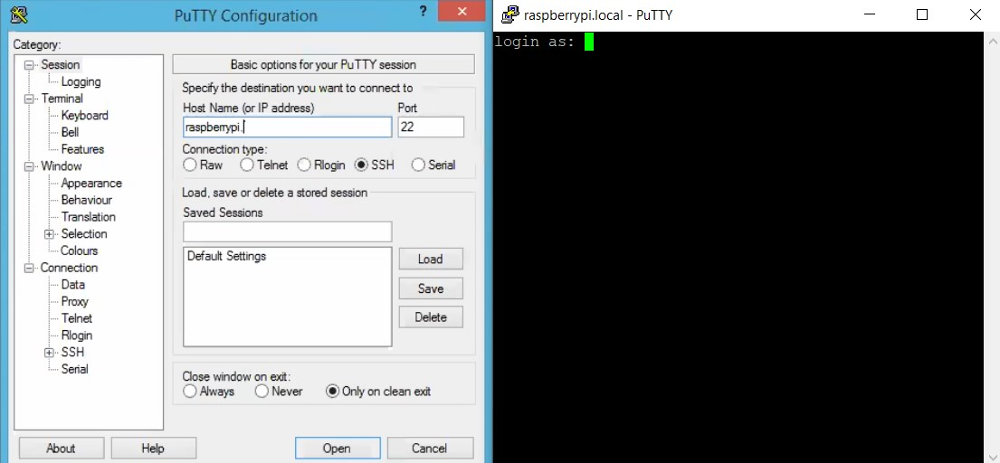  


         - Enable Rasspberry for ssh [Terminal based ]
         - Enable VNC 'Virtual network computing ' for gui openning of Rassperry 

      - 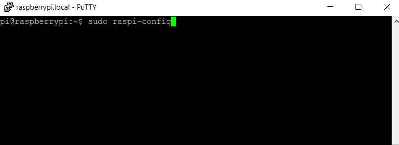  

      - 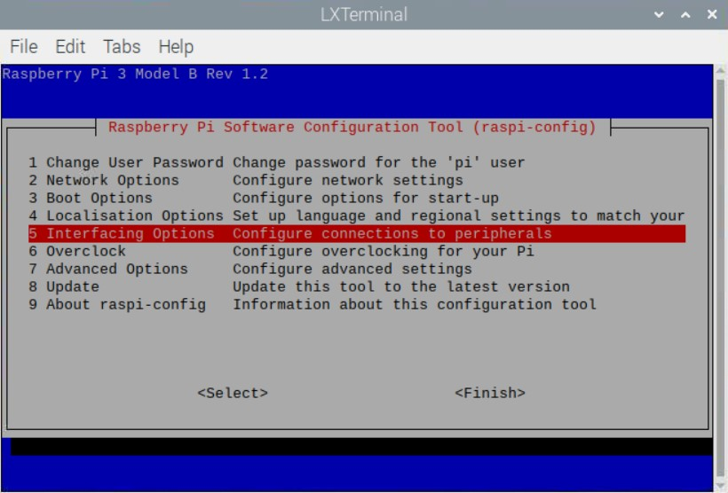 

      - 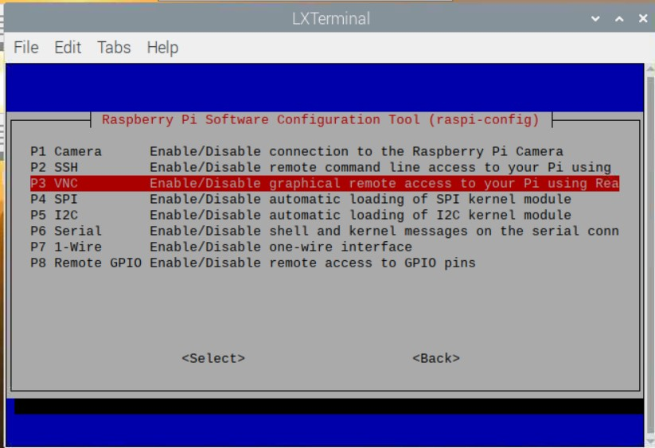 

      - To access through vnc viewer write the DNS or IP 
      -  

      - After opening raspberry Gui you can edit the reselution as the following : Enter to display>resolution.

      - 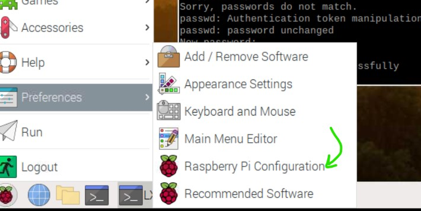 


### Method two through Ethernet cable [ToDo]:

- 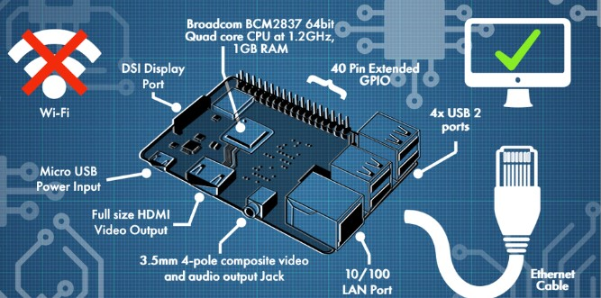 


# Most common linux command with Rpbi
- ifconfig : ifconfig is a command used for listing network interfaces on your unix machine 

- 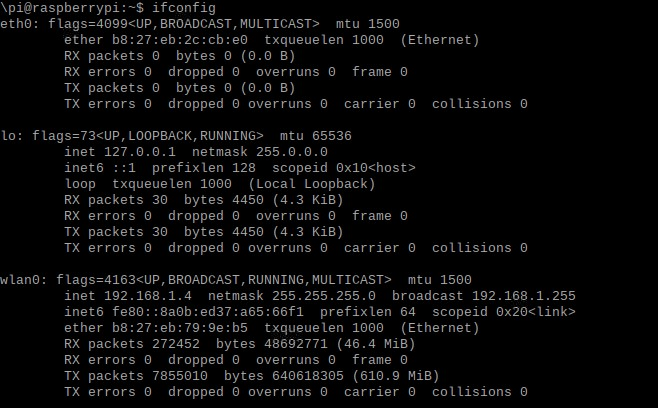 


# [Rpi3 config menu](https://www.raspberrypi.com/documentation/computers/config_txt.html)


- Enter rpi3 config menu by sudo raspi-config
- This page describes the console based raspi-config application. If you are using the
Raspberry Pi desktop then you can use the graphical Raspberry Pi Configuration
application from the Preferences menu to configure your Raspberry Pi.
- Generally speaking, raspi-config aims to provide the functionality to make the
most common configuration changes. 
- This may result in automated edits to
/boot/config.txt and various standard Linux configuration fil

### what config.txt contains : 

#### System Options
The system options submenu allows you to make configuration changes to various parts
of the boot, login and networking process, along with some other system level changes.
#### Wireless LAN
Allows setting of the wireless LAN SSID and passphrase.
#### Audio
Specifiy the audio output destination.
#### Password
The default user on Raspberry Pi OS is pi with the password raspberry. You can change
that here.
#### Hostname
Set the visible name for this Pi on a network.Rpi3 config
#### Overclock
On some models it is possible to overclock your Raspberry Pi's CPU using this tool. The
overclocking you can achieve will vary; overclocking too high may result in instability.
Selecting this option shows the following warning:Be aware that overclocking may
reduce the lifetime of your Raspberry Pi.
#### Overlay File System
Enable or disable a read-only filesystem
#### Boot Order
On the Raspberry Pi4, you can specify whether to boot from USB or network if the SD
card isn't inserted
#### Boot / Auto login
From this submenu you can select whether to boot to console or desktop and whether
you need to log in or not. If you select automatic login, you will be logged in as the pi
user.
#### Network at Boot
Use this option to wait for a network connection before letting boot proceed.
#### Resolution
Define the default HDMI/DVI video resolution to use when the system boots without a
TV or monitor being connected. This can have an effect on RealVNC if the VNC option is
enabled.
#### Interfacing Options
In this submenu there are the following options to enable/disable: Camera, SSH, VNC,
SPI, I2C, Serial, 1-wire, and Remote GPIO


## Beagle bone, raspberry pi, Intel edison.
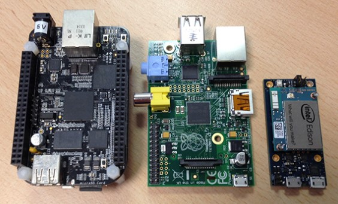
- `choose wisely depending on your needs, because both single-board computers can deliver massive computing powers.`

[Note] 
Beaglebone contains switches:
- Network booting switch : to boot from a network.  
- MMC booting  : external SD card to boot from. 
- EMMC booting : SOC Embedded sd card to boot from. 

# Remote file copy [scp]

- Supported linux command `man scp`

- 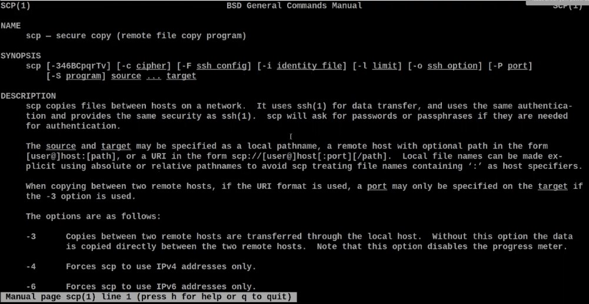

- 

- SCP : Secure remote copy which help to transfere data over ssh from server to client .
- you can copy files between
computers, say from your Raspberry Pi to your desktop or laptop, or vice-versa.

- you can transfere data through: 
   - open win scp and enter server data as shown 

   - 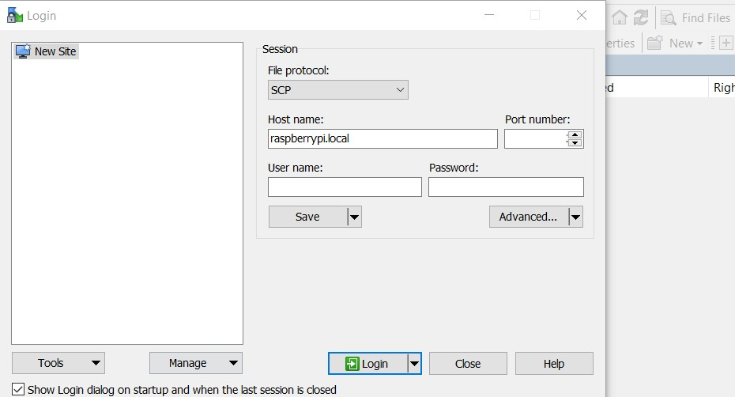
  
   - 
  
   - 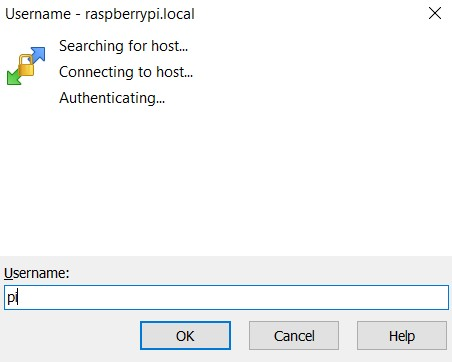

   - Then enter the password raspberry 

   - Then you are able to drag and drop files 
   - 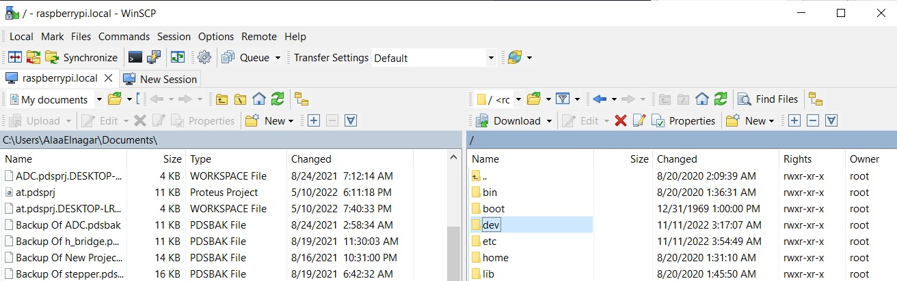 
- To get rasspberry pi pin out write `pinout`
   - 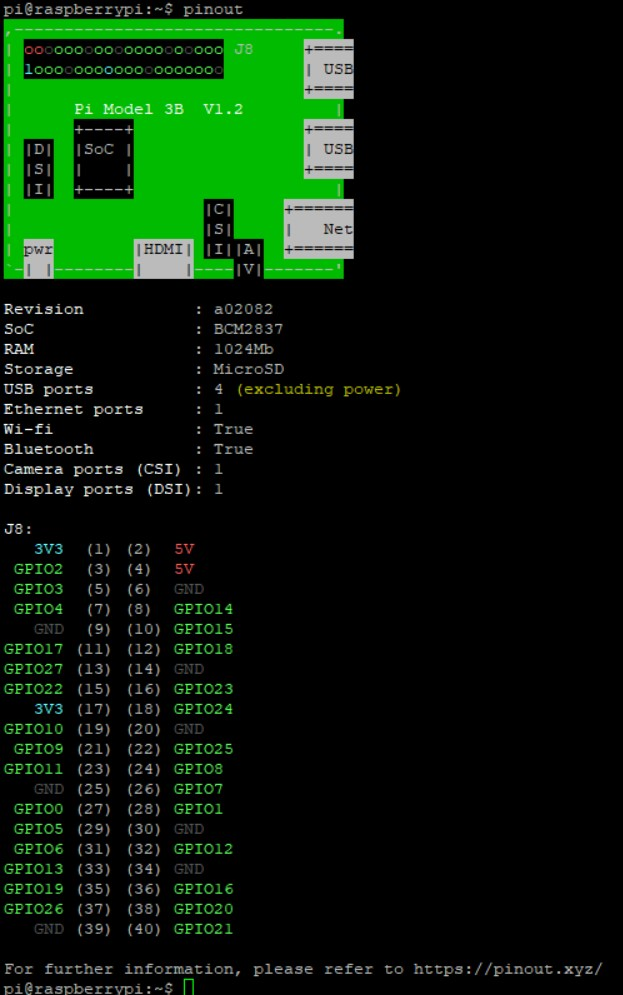

# conclusion 

- We got raspberry pi as peice of metal 
- Burnning img `raspian` to SD Card 
- the image divided to :  
    - Fat32
       - Contains boot partition 
       - kernal 
       - Bootloader 
       - Config file 
       - ssh file 
       - Wifi configuration `wpa` 
    - ext4
       - Contains linux root files 
       - System 
 - Blug in sd card  
 - power up 
 - Putty ssh `Terminal based `
 - enable vnc `sudo raspi-config`
 - open vnc through ip or DNS 


# Work flow 

- Python : 

     - Portable [win - Linux - MAC]
     - IOT Application support 
     - GUI Creation 

- Linux OS :

      - Available HW drivers 
      - Task mangement 
      - multi threaded `Concerrent application`

# QEMU 
   - 

- QEMU is a free and open-source emulator. 
- emulates the machine's processor through dynamic binary translation.
- provides a set of different hardware and device models for the machine, enabling it to run a variety of guest operating systems


# RPi.GPIO module: 

BCM  Vs SOC numbering system : 


RPi.GPIO is a package that provides a class to control the GPIO on a Raspberry Pi.
The RPi.GPIO module is installed by default in Raspbian. To make sure that it is at
the latest version: <br >
/*To synchronize local list with remote list of rbpi server*/
- `sudo apt-get update` <br >
/*To install the pakages that you interested in which exist in remote list*/
- `sudo apt-get install python-rpi.gpio`
- `sudo apt-get install python3-rpi.gpio`


### Usge of RPBI GPIO Pins 

- define numbering BCM OR Board 
- define direction input or output 
- set value or check value 

```
# import GPIO Module
import RPI.GPIO as GPIO

'''
There are two ways of numbering the IO pins on a Raspberry Pi within RPi.GPIO.
The first is using the BOARD numbering system. This refers to the pin numbers on
the P1 header of the Raspberry Pi board. The advantage of using this numbering
system is that your hardware will always work, regardless of the board revision of
the RPi. You will not need to rewire your connector or change your code.
'''
GPIO.setmode(GPIO.BOARD)


'''
The second numbering system is the BCM numbers. This is a lower level way of
working - it refers to the channel numbers on the Broadcom SOC. You have to
always work with a diagram of which channel number goes to which pin on the
RPi board. Your script could break between revisions of Raspberry Pi boards

'''
GPIO.setmode(GPIO.BCM)


'''
You may be already familiar with Digital Input Output Peripheral in any other
development board. The DIO peripheral allows two options for each pin, Input
and Output. You must configure the pin mode before working on it.
Mode:
 - GPIO.IN
 - GPIO.OUT
'''
GPIO.setup(PinNumber , Mode)

'''
OutValue
Mode:
● GPIO.HIGH
● GPIO.LOW
'''
GPIO.output(PinNumber , Mode)

'''
OutValue:
- GPIO.HIGH
- GPIO.LOW

'''
GPIO.setup(channel , GPIO)

'''
Optionally you can define an initial value for the pin while configuring it as
output
'''
GPIO.setup(channel , GPIO.OUT, initial=GPIO.HIGH)

'''
- To read the value of a GPIO pin use input function
- Warning: Do not apply more than 3.3v on GPIO pin used as input.

value will be [True - False]
'''
value = GPIO.input(PinNumber)

'''
 the default value
of the input can be set. It is possible to have pull up/down resistors in hardware and
using software. In hardware, a 10K resistor between the input channel and 3.3V (pullup) or 0V (pull-down) is commonly used. The RPi.GPIO module allows you to configure
the Broadcom SOC to do this in software
'''
GPIO.setup(channel,GPIO.IN, pull_up_down=GPIO.PUD_PU)

GPIO.setup(channel,GPIO.IN, pull_up_down=GPIO.PUD_DOWN)

'''
At the end any program, it is good practice to clean up any resources you might have
used. This is no different with RPi.GPIO. By returning all channels you have used back
to inputs with no pull up/down, you can avoid accidental damage to your RPi by
shorting out the pins. Note that this will only clean up GPIO channels that your script
has used. Note that GPIO.cleanup() also clears the pin numbering system in use
'''
GPIO.cleanup()

```


# Lab1
 - Led on of usong command 
 - To run `python3.7 <lab_name>`
 - Need To clean up the pin after each operation 

```
#lab1--> led on off

import RPi.GPIO as GPIO

GPIO.setmode(GPIO.BCM)

GPIO.setup(2,GPIO.OUT)

GPIO.setup(3,GPIO.OUT)


while True:

	x=str(input("please enter the value:"))

	if x=="ON":

		GPIO.output(2,GPIO.HIGH)

		GPIO.output(3,GPIO.HIGH)

	elif x=="OFF":

		GPIO.output(2,GPIO.LOW)

		GPIO.output(3,GPIO.LOW)	

	else:

		print("invallid value, try again")


```

# Lab2
 -  control on motor and led and buzzer

```
#lab2 --> control on motor and led and buzzer

import RPi.GPIO as GPIO

GPIO.setmode(GPIO.BCM)

GPIO.setup(2,GPIO.OUT,initial=GPIO.LOW)

GPIO.setup(3,GPIO.OUT,initial=GPIO.LOW)

GPIO.setup(4,GPIO.OUT,initial=GPIO.LOW)

while True:

	print("|----------------------------------------|")

	print("if you want to control on motor press 1  |")

	print("if you want to control on led press 2    |")

	print("if you want to control on Buzzer press 3 |")

	print("if you want to close your system press 4 |")

	print("|----------------------------------------|")


	choice=int(input("please enter your choice:"))


	if choice==1:

		print("|----------------------------------------|")

		print("|Motor on---> enter (ON)                 |")

		print("|Motor off---> enter (OFF)               |")

		print("|----------------------------------------|")

		choiceControl=str(input("please enter your choice:"))

		if choiceControl=="ON":

			GPIO.output(2,GPIO.HIGH)

		elif choiceControl=="OFF":

			GPIO.output(2,GPIO.LOW)

		else:

			print("invalid choice")

	elif choice==2:

		print("|----------------------------------------|")

		print("|LED on---> enter (ON)                 |")

		print("|LED off---> enter (OFF)               |")

		print("|----------------------------------------|")

		choiceControl=str(input("please enter your choice:"))

		if choiceControl=="ON":

			GPIO.output(3,GPIO.HIGH)

		elif choiceControl=="OFF":

			GPIO.output(3,GPIO.LOW)

		else:

			print("invalid choice")

	elif choice==3:

		print("|----------------------------------------|")

		print("|Buzzer on---> enter (ON)                 |")

		print("|Buzzer off---> enter (OFF)               |")

		print("|----------------------------------------|")

		choiceControl=str(input("please enter your choice:"))

		if choiceControl=="ON":

			GPIO.output(4,GPIO.HIGH)

		elif choiceControl=="OFF":

			GPIO.output(4,GPIO.LOW)

		else:

			print("invalid choice")

	elif choice==4:

		print("Thank you for using My system")

		print("*******Good Bye*********")

		exit()

	else:

			print("invalid choice")


```

# Lab3
  - control on led using GUI  
```

#lab3--> control on led using GUI  
import RPi.GPIO as GPIO
import tkinter

toggle_flag=0

def tog():
    global toggle_flag
    if toggle_flag == 1:
        GPIO.output(2, GPIO.HIGH)
        toggle_flag = 0 
    elif toggle_flag == 0:
        GPIO.output(2, GPIO.LOW)
        toggle_flag = 1

GPIO.setmode(GPIO.BCM)
GPIO.setup(2,GPIO.OUT, initial=GPIO.LOW)


mainwindow =tkinter.Tk()
mainwindow.geometry("350x300+100+50")
mainwindow.title("## LED ##")

button1= tkinter.Button(mainwindow, width= '15', text= 'toggle', command = tog)
button1.grid(row=1, column=1 )
mainwindow.mainloop()

```

#Lab4  Configure pin during run time   `Runtime Configuration`
```
#lab4 

import tkinter 

import RPi.GPIO as GPIO

toggle = 0 

def ConfigurationPin():

	global PinNumber_Entry

	LED=int(PinNumber_Entry.get())

	GPIO.setmode(GPIO.BCM)

	GPIO.setup(LED,GPIO.OUT)

	toggle_function(LED)


def toggle_function(PinNumber):

    global toggle

    toggle=toggle^1

    GPIO.output(PinNumber,toggle)

 

Toggle_Window = tkinter.Tk()

Toggle_Window.title("Toggle_Window ")  

Toggle_Window.geometry("300x200")

PinNumber_Label=tkinter.Label(Toggle_Window,text="Pin Number")

PinNumber_Label.grid(row=0,column=0)

PinNumber_Entry= tkinter.Entry(Toggle_Window)

PinNumber_Entry.grid(row=0,column=1)

Toggle_Button= tkinter.Button( Toggle_Window , text = "Toggle" , command = ConfigurationPin )

Toggle_Button.grid ( row = 1 , column = 1)

tkinter.mainloop()

```

# Lab5 `Receiving input from Button`

```
import RPi.GPIO as GPIO

import time

GPIO.setmode(GPIO.BCM)

GPIO.setup(2,GPIO.OUT) 

GPIO.setup(3,GPIO.IN,pull_up_down=GPIO.PUD_UP) 

while True:

	PinValue=GPIO.input(3)

	time.sleep(0.1)

	if PinValue==0:

		GPIO.output(2,GPIO.HIGH)

	else:

		GPIO.output(2,GPIO.LOW)

```


# Lab6,7,8 Thread Creation 
```

import threading 
import time 
therad1_counter=0
therad2_counter=0
def print_thread1(num): 
    """ 
    function to print cube of given num 
    """
    while True:
        print("Hi thread 1")
        time.sleep(1)
  
def print_thread2(num): 
    """ 
    function to print square of given num 
    """
    while True:
        print("Hi thread 2") 
        time.sleep(1)
  

# creating thread 
t1 = threading.Thread(target=print_thread1, args=(10,)) 
t2 = threading.Thread(target=print_thread2, args=(10,)) 

# starting thread 1 
t1.start() 
# starting thread 2 
t2.start() 

# wait until thread 1 is completely executed 
t1.join() 
# wait until thread 2 is completely executed 
t2.join() 

# both threads completely executed 
print("Done!") 


```


## Raspberry pi serial 

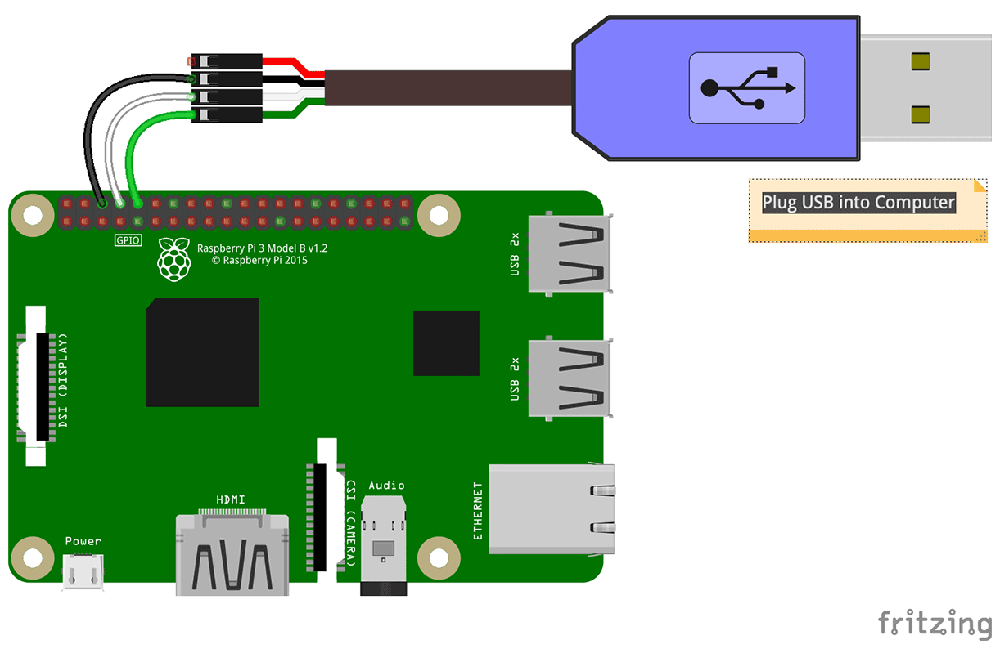  

- During connecting with rassperry pi serial using `USB TO TTL` the network password can bbe changed using the command : 
`wpa_passphrase [ ssid ] [ passphrase ]`

- To check if the network user and password changed or not do the following command  from `/home/pi`: 

`cat /etc/wpa_supplicant/wpa_supplicant.conf`

# UART [Debugging Master For kernals ]:


- Asynchronous communication protocool 
- PhysiCally to connect from RX 
mention UART Frame

- set the boad rate for both TX and RX


# make sure that UART Is enabled in your pi
- Write `sudo raspi-config`
- select interface option 
- Serial port enable disable
- reboot

- 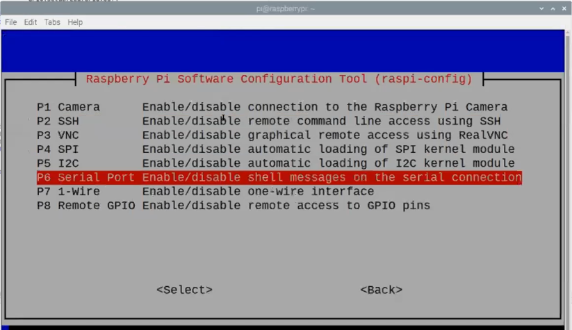

- Then open putty or tera term to see :
- 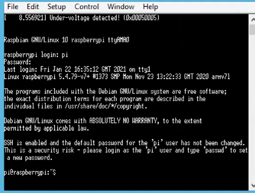

[Note] : 

## Raspberry UART Reality: 

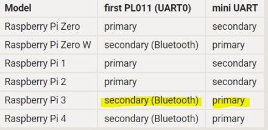

According ti RBPI.org  Raspberry `Pi Zerro , 1 , 2  3` contains Two UART :
- [PL011]Secondery UART, UART 0 :  
  - To Enable it : Make a varaiable called `enable_uart=1` in `config.txt file `
  -  Contains more functionalities like frame error detection.
  - Connected internally with bluetooth controller not GPIO 
  - To switch UART Connection from bluetooth to GPIO 
  A some configuration is needed. 


- [mini UART] Primary UART, UART 1 :
  - Is called mini because it's contians minimum functionalities 


## About [overlays]:
- A folder in the image which contains the hardware specifications , and the reason behind that is hardware isolation away from the kernal. 

- dtb : is a file which contains hardware description. 

- dtbo : `device tree blob overlay `is a file which exist inside overlays [for ex. disabling the bluetooth - enabling UART0]

- when a new configuration added to the config.txt file related to HW edit as shown 

`sudo nano /boot/config.txt`
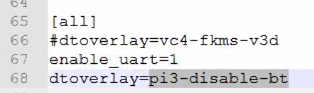

- Once kernal run a  file will be linked according to the new configuration prameter to be includded by the kernal to be able to disable the blutooth as shown `this file is precomiled in oberlays`


    
### Watchout before connecting of USB To TTL it needed to be 3.3v

Finally connect the usb to ttl and do the following 
 
 - List all of the avialable serial devices
 - write to the file which linked to a specific serial  
 -  See the echo in the term. <br >

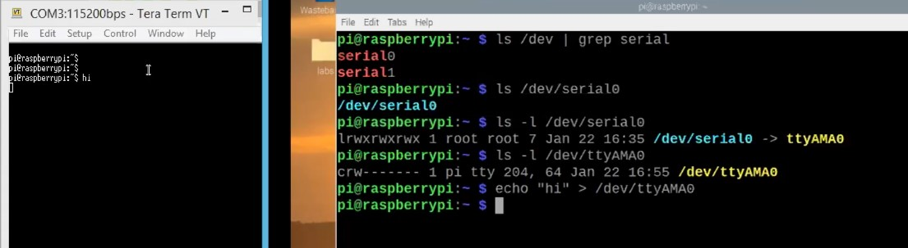
Also you can write directly over the serial 
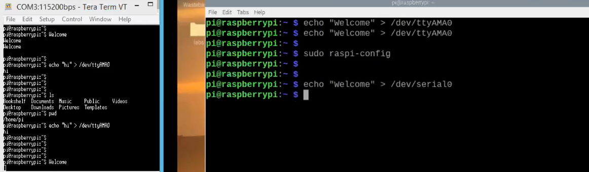

# To access UART for RPBi commanding as login prombot
`sudo raspi-config`
    - Interface options 

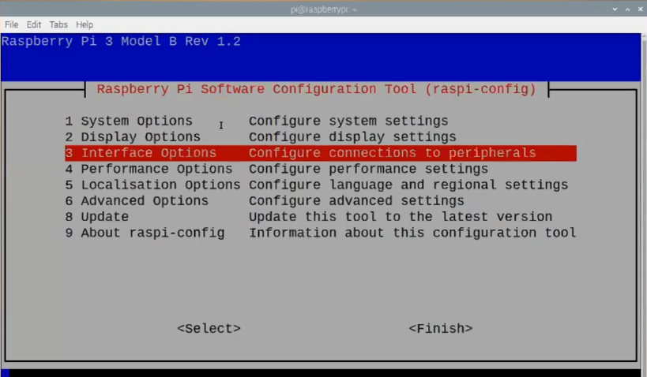
    
`P6 Serial port `
    
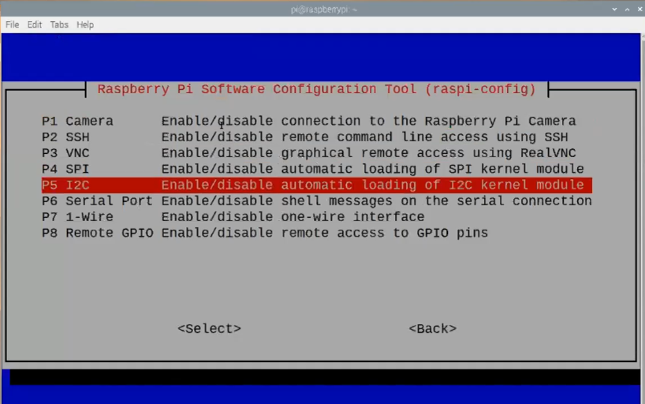
    
- To access UART for login prompot and to be able to send command line operation <br >

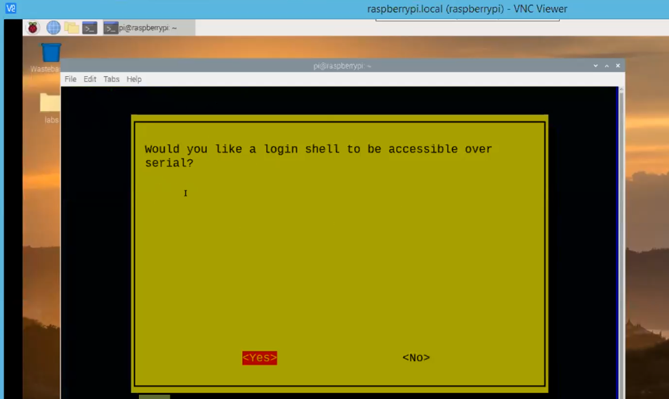
    
-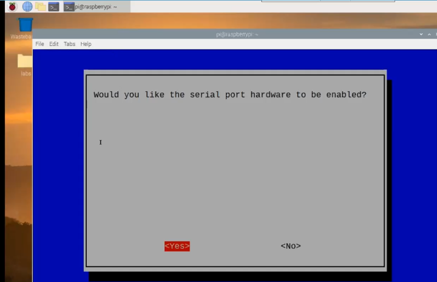 

`To Enable serial interface and disable login shell`
-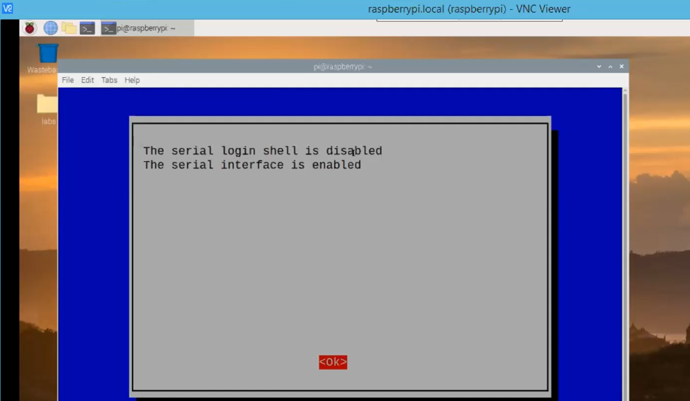 

[Note]

 - All of the above done with boad rate 115200
 - To be able to fix putty to work with fixed boad rate open `.ini` in putty settup file which able to change the configuration  


# Interrrupts [SW Interrupt] [Manged By OS]

- Interrupt effect may be 
     - (rising edge) or from HIGH to LOW (falling edge). Quite often, we are more concerned by a change in state of an input than it's value. This change in state is an event.
- GPIO provide the function `add_event_detect` that allows you to detect detect events
for: 
  -  GPIO.RISING
  -  GPIO.FALLING 
  -  GPIO.BOTH   


  # Lab 10 Interrupt 

```

import RPi.GPIO as GPIO
def init():
	GPIO.cleanup()
	GPIO.setmode(GPIO.BCM)
	GPIO.setup(2,GPIO.OUT)
	GPIO.output(2,GPIO.LOW)
	GPIO.setup(3,GPIO.IN,pull_up_down=GPIO.PUD_UP)
LedState=0
def Toggle(PinNumber):
	global LedState
	print(PinNumber)
	if LedState==0:
		LedState=1
		GPIO.output(2,GPIO.HIGH)
	elif LedState==1:
		LedState=0
		GPIO.output(2,GPIO.LOW)	
	
init()
# Set pin 3 as input Rising 
 '''
  -  GPIO.RISING
  -  GPIO.FALLING 
  -  GPIO.BOTH   
 ''' 
GPIO.add_event_detect(3,GPIO.RISING,callback=Toggle,bouncetime=300)

try:
	while True:
		pass
		
except KeyboardInterrupt:
	GPIO.cleanup()


```


# Timers 

- Usage: Periodic events

# Lab 

```
import RPi.GPIO as GPIO
import threading 
Led=2
LedState=0
def init():
	GPIO.setmode(GPIO.BCM)
	GPIO.setup(Led,GPIO.OUT)
	GPIO.output(Led,GPIO.LOW)
LedState=0
def mycallback():
	global LedState
	global t
	if LedState==0:
		LedState=1
		GPIO.output(Led,GPIO.HIGH)
	elif LedState==1:
		LedState=0
		GPIO.output(Led,GPIO.LOW)	
    #Reschedular timer
	t=threading.Timer(5,mycallback)
	t.start()
	while True:
		print("yes")
	
init()
# Create timer 
t=threading.Timer(5,mycallback)
# Start timer 
t.start()
try:
  while True:
    print("hello")
except KeyboardInterrupt: 
  GPIO.output(Led,GPIO.LOW)
  GPIO.cleanup()
  exit()

```


# Task 

Make schedular 
2 sec task led 
4 sec task led 


# How to kill a process 
```
ps -aux | grep python 

kill PID

```


# PWM 

D = Ton/[TON + TOFF]


## To create PWM Instance 

- Pwm_S = GPIO.PWM(Channel , frequency_in _HZ)
- Use the following methods 
     - Pwm_S.start(duty_cycle) [where duty_cycle is between 0.0 <= dc <= 100.0]
     - Pwm_S.ChangeFrequency(freq) [where freq in the value in Hz]
     - Pwm_S.ChangeFrequency(freq) [where duty_cycle is between 0.0 <= dc <= 100.0]
     - Pwm_S.stop() [stop the PWM signal]

# Lab PWM With tkininer 
```
import RPi.GPIO as GPIO
import tkinter
def init():
	GPIO.cleanup()
	GPIO.setmode(GPIO.BCM)
	GPIO.setup(2,GPIO.OUT)
	GPIO.output(2,GPIO.LOW)
def Tone_one():
	PwmCh.ChangeFrequency(300)
def Tone_two():
	PwmCh.ChangeFrequency(200)
def Tone_three():
	PwmCh.ChangeFrequency(100)	
init()
PwmCh=GPIO.PWM(2,100)
PwmCh.start(50)
window=tkinter.Tk()
window.title("tones")  
window.geometry("300x200")
Tone_one_Button= tkinter.Button( window , text = "Tone One" , command = Tone_one)
Tone_one_Button.pack()
Tone_Two_Button= tkinter.Button( window , text = "Tone Two" , command = Tone_two)
Tone_Two_Button.pack()
Tone_Three_Button= tkinter.Button( window , text = "Tone Three" , command = Tone_three)
Tone_Three_Button.pack()
tkinter.mainloop()
```

# IOT [Voice Controlled System ]

Prereq : 

 - Download google assistant. 
 - Prepare your gmail [User - Password]

## IOT Applications: 

- Low cost 
   - Connection of devices such as Lamp or relay to the Internet [ON/OFF]
   
- Medium COST
   - Such as Home automation systems [GUI Controll with data logging ]

- High Cost 
   - Realtime and Safety critical IOT Applications Example in auttomotive data reporting, NASA, TESLA Application 

## Target IOT Level is for Medium Level for Voice Controlled system using google assistant AI Frame work. 

# IFTTT [If This Then That ]
A very important aplication which useful for iot application
  
   - IFTTT Is a server which Coonnect two services 
      -  Service 1 google Assistant `Triggering Source`
      -  service2 Webhook to get received Trigger request and send it as  Reqst or to web server to communicate with PI 
      -  The rassperry PI process The request from the web server to control Led 

   [Note]: 
   When connecting two services through IFTT it's called `applet or receipe`

   # Steps:
   1. Configure Service1 google assistant 
   2. Configure Service2 Webhook
   3. Configure Webserver
   4. Configure RaspberryPi ti receive from webserver


# Step1 goto IFTT application through this [Link](https://ifttt.com/)


# Create a new account 
This is IFTT which responsible for Linking Between Two accounts. 
- Select Create In the up right 


- After selection the following window will appear 
- Select add to Select a service at if This
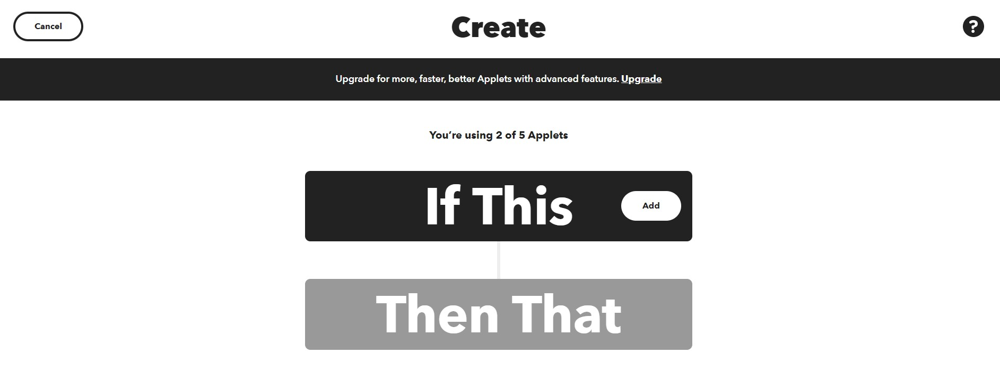

# Search for google assistant 
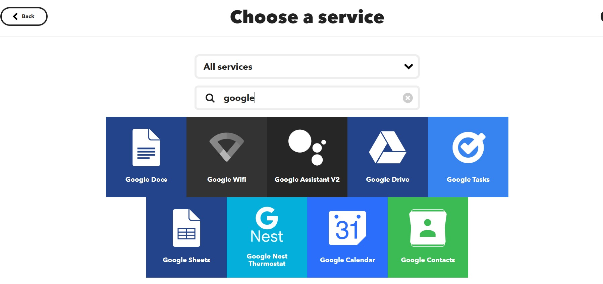

- Select activate Scene 


- Select the Scene Name 


- Then Select That 

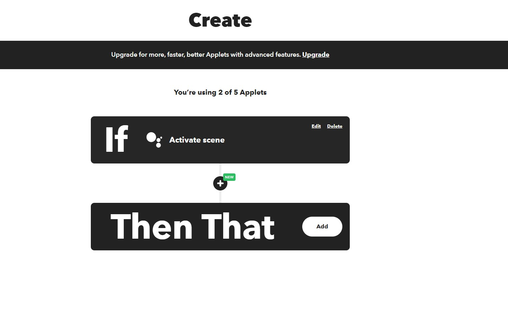

- Select Webhook  
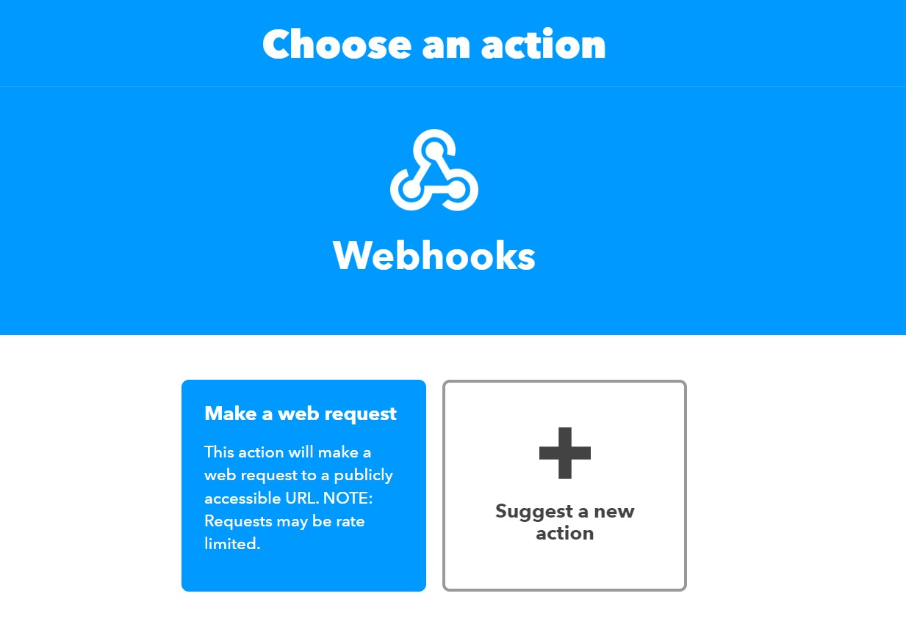

# For the Web hook 
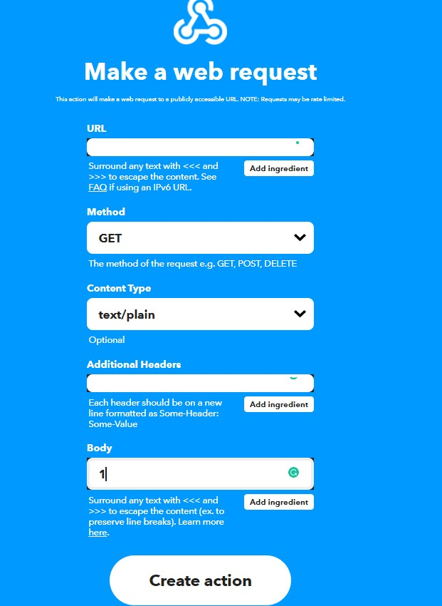

1. Link to send the dat to web server 
2. GET Method to receive from google assistant 
3. Set content type as text/plain to be send to the web page 
4. send body as 1 

# Where to get web server link from 
1. Search for python anywhere from this [Link](https://www.pythonanywhere.com/)


from pricing and sign up select beginer account 


- Select web and then add a new web app 

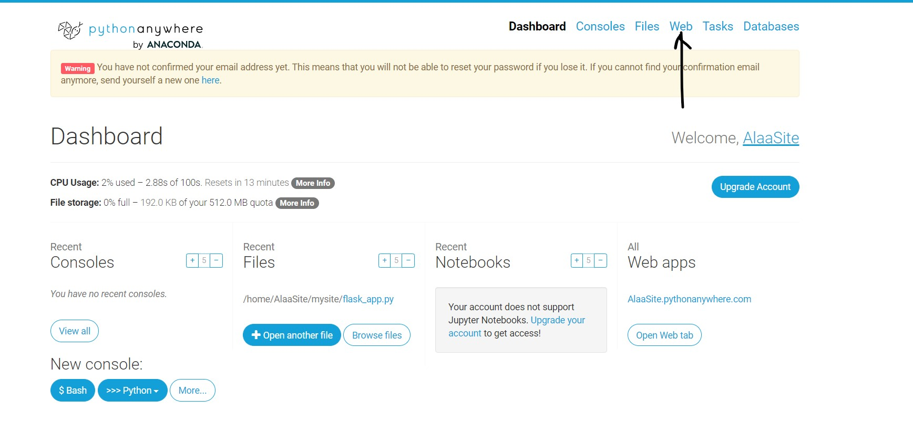


- Select flask webserver to be able to use python code Then Next 


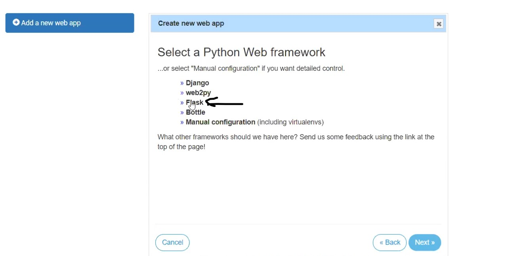

- Then scroll down to goto to code directory 


- Select Mysite 


- Select Flask app.py 

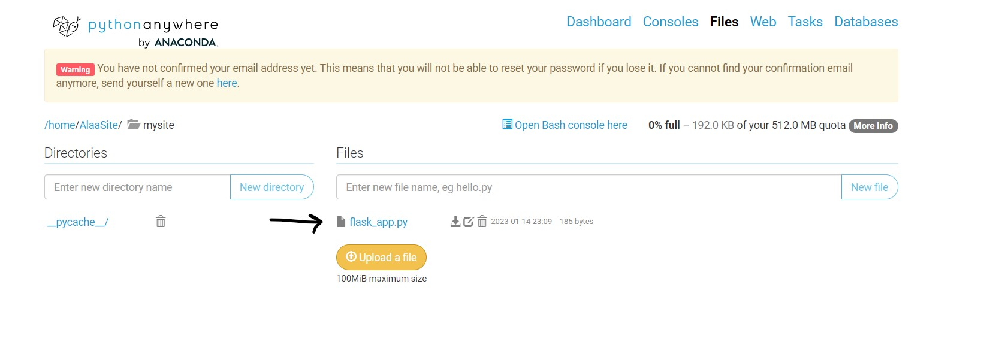

- Then you can see the Development area 

```
 @app.route('/') # Define Sub domain 

```
To run the Code don't Forget to save it and then reload 

```

# A very simple Flask Hello World app for you to get started with...

from flask import Flask
from flask import request
app = Flask(__name__)

pivalue = '1'
led_state = '0'
#this the page that rpi3 will lesten to it
@app.route('/')
def hello_world():
    global led_state
    return str(led_state)

#this the page that ifttt will set data, and web server will get
@app.route('/IFTTT')
def Receive():
    global led_state
    led_state = str(request.get_data())
    return ''

```

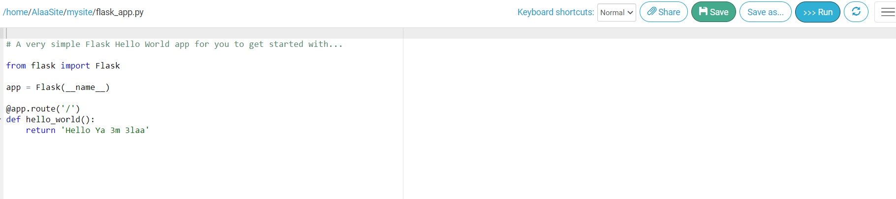

- To open Back your webpage go to web and then you can find the page Link 


- Then you can enter the Link to another tap to be able to see the updates 


- You can add Sub domain as following 
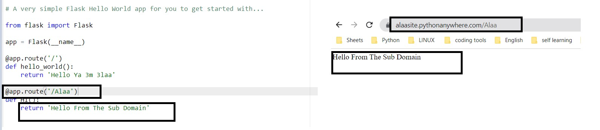

-  Add your website page address as following 

  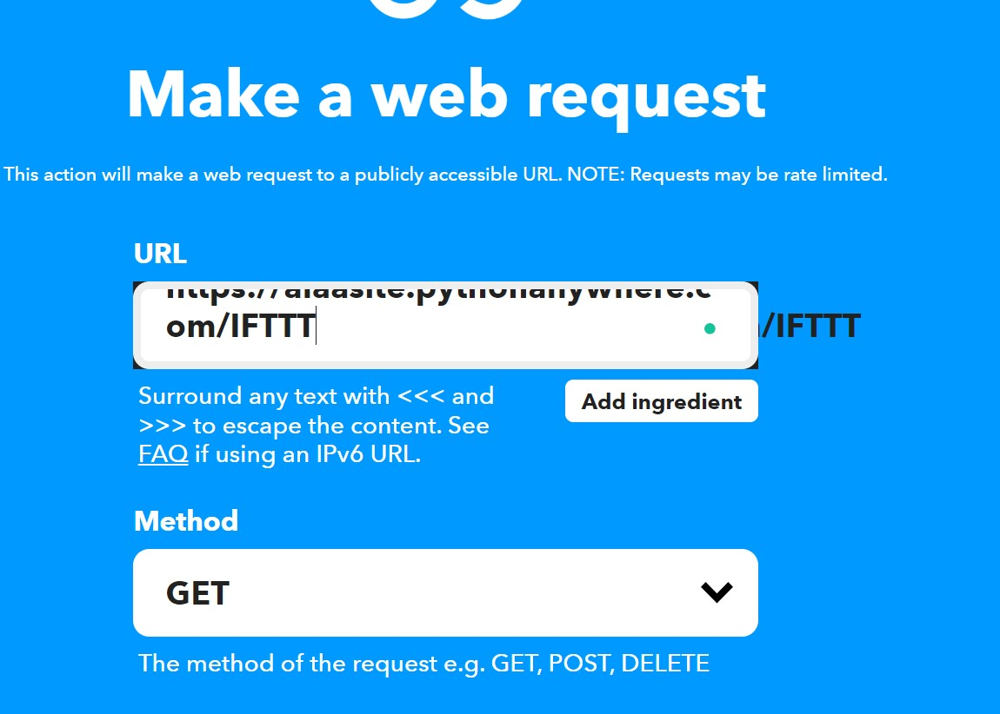

Condlusion : 
Google assist trigger webhook to triger python web page with the value in the Body 

- Select Continue and then the applet is ready 

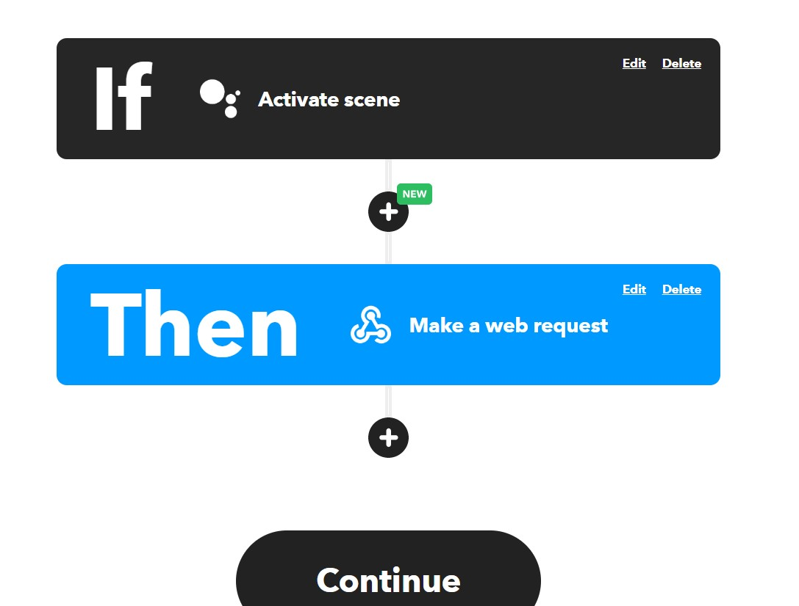

- Then You will get a summerize as following 

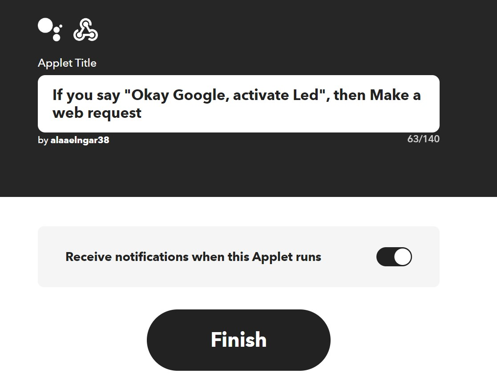

- Then You are able to write to the server through google assistant


# RPBI Side 

```
import RPi.GPIO as GPIO
import requests
def init():
	GPIO.cleanup()
	GPIO.setmode(GPIO.BCM)
	GPIO.setup(2,GPIO.OUT)
	GPIO.output(2,GPIO.LOW)

init()

data="0"
while True:
    data=requests.get("https://alaasite.pythonanywhere.com/")
    if str(data.text) == 'b\'0\'':
        GPIO.output(2,GPIO.LOW)
        print("Light is off")
    elif str(data.text) == 'b\'1\'':
        GPIO.output(2,GPIO.HIGH)
        print("Light is on")
    elif str(data.text) == 'b\'exit\'':
        print("Exiting...")
        exit()
    else:
        print('Invalid Response')

print('Program finished')
GPIO.cleanup()


```
# How internet work
## ICAN : 
Organization which manage communicaion between nodes through dividing the world into 5 main parts according to Region internet service provider ISP Which is ICAN And provide to main 5 five regions and each region provide to local companies


For example AFrinic has internet service providers like `we` - vodafone  and so on through modem which may be wired through telephone or wirless through 3G-4G-5G

- Each modem has IP
## How to distripute IP's To the whole world
Router contains modem - And router is connected to the internet through modem wired or wirless
devices which will access interrnet contains NIC Network interface controller and NIC May be wired Ether net or wireless wifi and each device connected will has ocal ip to be connected to the router to save ip's for ICAN <BR />


Another solution to save IP Is called dynamic IP by changing the ip when the router is restarted or through a time
[Note] IP is a mix of four bytes B.B.B.B
[Note] There is a service which is called no ip which is based on a DNS without ip because there is a script which update and link the ip with the DNS

HOW TO Connect to internet
wifi module sim 800 which is 2G
NIC Which may be eathernet enc28j60
NIC Which provide WIFI ESP8266


# NO IP

- If you are in another network and need to connect to raspberry pi a need to Connect to global ip with static raspberry pi IP 

# Idea of NO IP 
- Router send The new Ip when it connect to the Network  to a specific webserver 
- The needed person to access the router get the dynamic ip from the webserver 


- The Idea based on a script which update the IP periodiclly to a webserver and also providing a specific domain 


- Then Confirm your account 

- 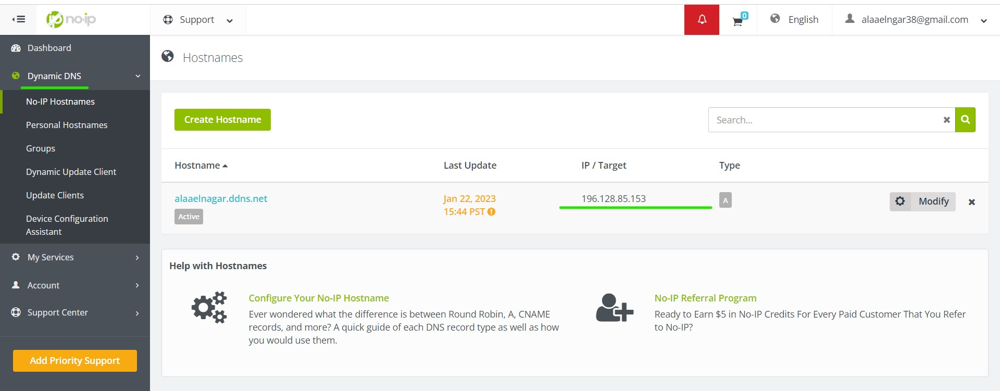

- Download the script which responsible sending the dynamic IP
https://www.noip.com/support/knowledgebase/installing-the-linux-dynamic-update-client/


```

cd /usr/local/src
wget http://www.no-ip.com/client/linux/noip-duc-linux.tar.gz
tar xzf noip-duc-linux.tar.gz
cd noip-2.1.9-1
make
make install

- add the noipmail
- add no ip pass
- add interval update time 

sudp noip2   # run the noip service 

sudo noip -s # to check if no ip work or not 

then try to connect with VNC From another network 

```


# Router PortForwarding

- The following steps Differ from Router to another 

# open Router page using `192.168.1.1` with aid of google chrome or download UC browser if not open 


# we need to detect raspberry pi IP Address as shown 
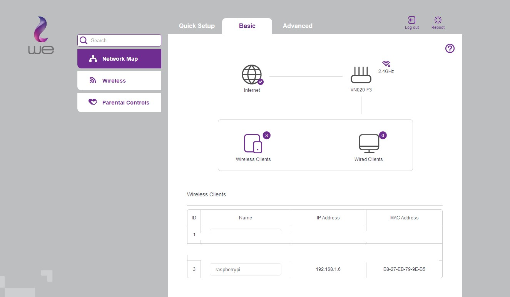


# Open DNS To set NO IP service User/pass/hostname


# Add new virtual server with port 5900 and raspberry pi ip address
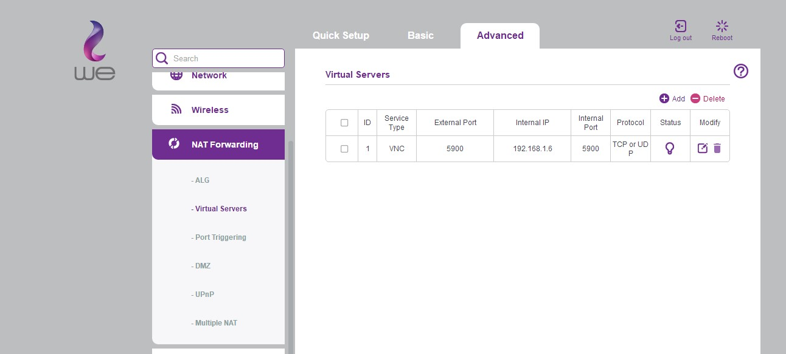


# Open VNC From anywhere 
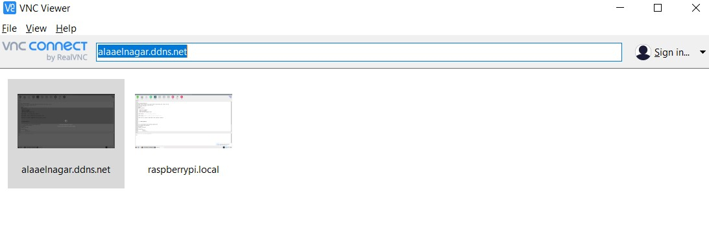

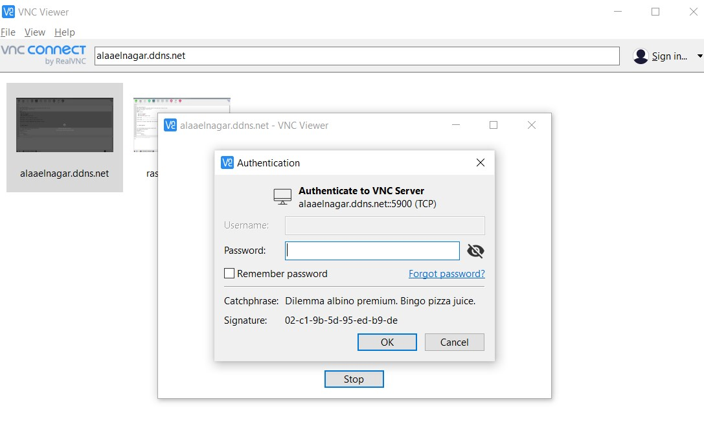
  # DBUS
  # nginx
  # ngrok
  # PostMan 
  # C++ 
  # Qt Course 
  # LLVM Toolkit 


